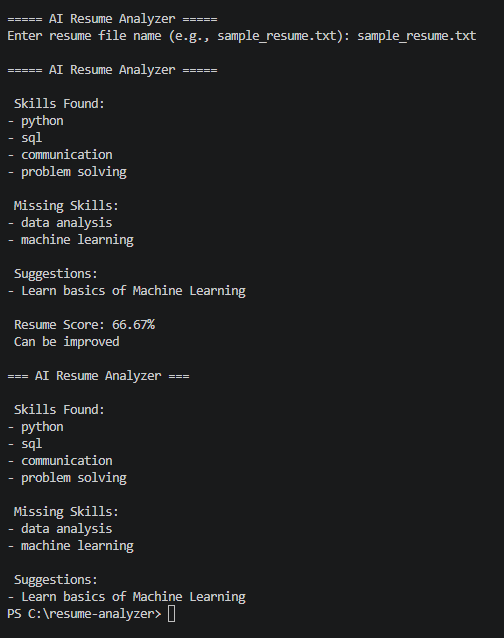

# 🧠 AI Resume Analyzer
## 📸 Screenshots

)

## 📌 Description
A Python-based tool that analyzes resumes and identifies missing skills using keyword matching.

## 🚀 Features
- Analyze resume text files
- Detect existing skills
- Identify missing skills
- Generate improvement suggestions
- Calculate resume score

## 🛠️ Technologies Used
- Python
- File Handling
- String Processing

## ▶️ How to Run
1. Place your resume in .txt format
2. Run:
   python main.py
3. Enter file name

## 📊 Example Output
- Skills found
- Missing skills
- Suggestions
- Resume score

## 👨‍💻 Author
Saurav Ram
